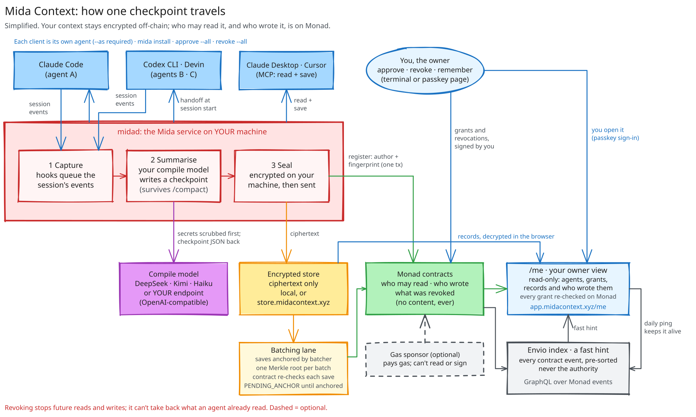

<h1 align="center">
  <picture>
    <source media="(prefers-color-scheme: dark)" srcset="brand/mida-lockup-animated-dark.svg">
    
  </picture>
</h1>

<p align="center">
  
  
  
  
  
</p>

<p align="center">
  <b>Switch AI agents without losing the work.</b> Mida saves what one agent was doing as a short,
  encrypted checkpoint you own, and hands it to the next agent you approve. Claude Code today, Codex
  tomorrow, whatever ships next month.
</p>

<p align="center">
  <a href="https://app.midacontext.xyz"><b>Owner page</b></a> &nbsp;·&nbsp;
  <a href="docs/quickstart.md">Full walkthrough</a> &nbsp;·&nbsp;
  <a href="docs/use-cases.md">Use cases</a> &nbsp;·&nbsp;
  <a href="docs/evidence">Evidence</a> &nbsp;·&nbsp;
  <a href="#quickstart">Run it yourself</a>
</p>

---

## The problem

You work with more than one AI agent. One runs out of usage, crashes, or you want a different one
for the next part of the job. The new agent starts blind. What you asked for, what the first agent
decided and why, what it tried and dropped, what is left: all of it stays inside the first tool.

We measured what "blind" costs. We gave a fresh Codex session a half-finished job and one word,
"Continue." Without a handoff it finished **0 of 6** runs. In all six it passed its tests and said it
was done, because it never learned that two of the five steps existed. With a Mida handoff printed
into the session at start, it finished **3 of 3**, kept a rule only the first agent had heard, and
restated the key decision and its reason
([method and runs](docs/superpowers/specs/2026-09-20-p0-handoff-design.md)).

Today you paste transcripts or keep a notes file. That file belongs to no one, any program on your
machine can read it, and you cannot take it back from an agent you stop trusting. The tools also
change every few weeks. Your context should not be the reason you stay with one of them.

> [!IMPORTANT]
> **Pre-release. Monad testnet only. Not audited.** The full loop ran live on Monad testnet on
> Sep 27, 2026: Claude Code to Codex and back, Devin, Claude Desktop, and a revoke that cut an agent
> off mid-project ([what ran](docs/evidence/live-tests-2026-09-27-to-29.md)). See
> [What works and what doesn't](#what-works-and-what-doesnt) before you rely on it.

## What Mida does

Mida is a small service on your machine plus a set of permission rules on a public blockchain
(Monad testnet).

- **It captures.** Hooks in your agent tell the service what the session is doing.
- **It summarises.** A model you choose turns the session into a **checkpoint**: your original
  request word for word, the goal, progress, decisions with reasons, rejected approaches,
  constraints, and the next step. A message you typed mid-session counts as yours, and a later
  instruction from you overrides the first one.
- **It encrypts on your machine.** The store only ever holds ciphertext.
- **It records permissions and authorship on Monad.** The chain says which agent may read which
  kind of context and which agent wrote each record. Content never goes on chain.
- **It hands off.** When an approved agent starts a session, Mida prints the latest checkpoint into
  it. You type "Continue." Mid-session, the agent can ask Mida again through its MCP tools.
- **You decide.** Only you approve or revoke an agent, from your own terminal. An agent cannot
  approve itself.

<picture>
  <source media="(prefers-color-scheme: dark)" srcset="docs/architecture/mida-architecture-dark.svg">
  
</picture>

## Who builds on Mida

Mida is a primitive for developers. Three kinds of software need what it provides:

- **Agents that hand work to other agents.** A planner hands to a coder, one vendor's agent hands to
  another's, a crashed session hands to a fresh one. They need the work to survive the switch.
- **Apps that act for a person.** Assistants, coding agents and MCP clients need the context the
  person approved, and only that.
- **Multi-agent systems that must show who did what.** Agent marketplaces, audit trails and agent
  registries need a record of which agent wrote or decided each thing that anyone can check.

Building this yourself means per-agent keys and encryption, a permission list the user controls and
can revoke, provenance someone else can verify, a handoff format, and an export so users can leave.
Teams keep rebuilding a slice of it by hand. The SDK gives you all of it in a few calls:

```ts
import { Mida } from "@mida-context/sdk"

const mida = new Mida({ agent: "my-agent" })
const { items } = await mida.context({ namespace: "projects.current", limit: 8192 })
await mida.remember({ namespace: "projects.current", content: { note: "user prefers pnpm" } })
```

The user registers your agent once with `mida add-agent my-agent`, and approves it with `mida approve my-agent`. Everything the SDK reads passes the
grants the user signed; your app never holds the user's owner keys. Full reference:
[`docs/sdk.md`](docs/sdk.md).

---

## Contents

- [Quickstart](#quickstart)
- [Supported agents](#supported-agents)
- [How it works](#how-it-works)
- [Commands](#commands)
- [Bring your own compile model](#bring-your-own-compile-model)
- [Security model and limits](#security-model-and-limits)
- [What it costs to run](#what-it-costs-to-run)
- [What works and what doesn't](#what-works-and-what-doesnt)
- [Where Mida is going](#where-mida-is-going)
- [Repository layout](#repository-layout)

---

## Quickstart

**You need:** Node.js 22 or later, and Claude Code and/or Codex. By default Mida uses a hosted
encrypted store and a gas sponsor, so you need no testnet tokens. A setup made before the sponsor existed
joins it with `mida sponsor on`.

```bash
npm install -g mida-context
mida init                       # your owner key and one identity per agent; add --passkey to approve with a passkey
mida install claude-code        # hooks, plus Mida's MCP tools so a session can ask Mida mid-task
mida install codex              # the same; then open Codex once, type /hooks, and trust the Mida entries
mida doctor                     # one line per check; every PROBLEM names its fix
```

Then, inside your project folder, in a real terminal window:

```bash
mida request claude-code
mida request codex
mida approve --all              # shows what each agent asks for; type yes
```

Work in Claude Code as usual. When you stop, or it runs out, open Codex in the same folder. The
session starts with a `Mida:` block holding the checkpoint. Type **Continue.**

```bash
mida revoke codex               # codex's future reads are refused, on chain
```

The full walkthrough, with the expected output of every step, is
[`docs/quickstart.md`](docs/quickstart.md).

<details>
<summary>Install from source instead</summary>

```bash
git clone --recurse-submodules https://github.com/damli40/mida-context && cd mida-context
pnpm install && pnpm build:publish
cd publish/cli && npm pack && npm install -g mida-context-0.1.1.tgz
```

</details>

## Supported agents

| Agent | How Mida connects | Status |
|---|---|---|
| Claude Code | Hooks, plus the MCP server for mid-session reads | Hooks live, Sep 27; MCP server in tests |
| Codex CLI and the Codex app | Hooks (trust them once in `/hooks`), plus the MCP server | Hooks live, Sep 27; MCP server in tests |
| Devin | Hooks | Live, Sep 27 |
| Claude Desktop | MCP server `mida-mcp`: `mida_handoff`, `mida_whats_new`, `mida_read`, `mida_status`, `mida_save` | Live, Sep 27 |
| Cursor | The same MCP server | In tests |
| Your own app | The SDK | In tests, local chain |

Each client gets its own identity, so you approve and revoke them one at a time. `mida install
<client>` writes the configuration for you, the MCP server included; `--no-mcp` leaves it out. ChatGPT chats are not supported: they cannot run local
hooks or a local MCP server.

---

## How it works

<details>
<summary><b>The path of one checkpoint</b></summary>

1. **Capture.** When the agent uses a tool, stops, compacts its context, or ends a session, its hook
   writes one small job into a queue and pokes the local service (`midad`). The hook does nothing
   slow, so your agent never waits on Mida.
2. **Summarise.** The service reads the session file, removes secrets (API keys, private keys,
   passwords, bearer tokens), and sends the text to your compile model, which returns the
   checkpoint as JSON. Messages you typed stay in view in long sessions too; if there are many, Mida keeps the newest and says how many it left out.
3. **Seal.** Mida encrypts the checkpoint on your machine with a key only approved agents can unwrap.
4. **Store.** The ciphertext goes to your local store or the hosted `store.midacontext.xyz`, which
   never has the keys.
5. **Anchor.** A Monad transaction records the author and a fingerprint of the content. With
   batching on, Mida's batcher anchors saves for you and pays the gas.
6. **Hand off.** When an approved agent starts, Mida reads the checkpoints as that agent, checks each
   permission against the chain, merges them, and prints the result into the new session.

</details>

<details>
<summary><b>What lives where</b></summary>

| Thing | Where | Who can read it |
|---|---|---|
| Checkpoint content | Encrypted store (local or hosted) | Agents you approved, with their own keys |
| Permissions, revocations, authorship | Monad testnet contracts | Anyone: they show that an agent may read an area, never the content |
| Your owner key | `~/.mida/owner/`, or your passkey (never on disk) | You |
| Agent keys | `~/.mida/agents/` | That agent's process on your machine |

Contracts: `CapabilityRegistry` (agents, grants, read-key generations, revocation),
`ContextRegistry` (authorship and history, fingerprints only) and `BatchAnchor` (many saves under one
Merkle root). Testnet addresses: [`contracts/deployments/10143.json`](contracts/deployments/10143.json).

Hosted services, all optional: `store.midacontext.xyz` holds ciphertext it cannot read,
`sponsor.midacontext.xyz` pays gas for Mida's own contract calls and can sign nothing else, and
`app.midacontext.xyz` is the passkey page for sign-up, approve and revoke.

</details>

<details>
<summary><b>Projects, folders and tasks</b></summary>

A project is a `.mida/project.json` marker; the nearest one up the tree wins. You approve an agent
per project. `mida link <folder>` lets a second folder join a project; `mida unlink` takes it out.

A project can hold several efforts at once. `mida task <name>` sets the folder's current task, and
each session keeps the task it started with. A handoff carries only its own task's checkpoints and a
one-line mention of the others. Facts and preferences you save with `mida remember` belong to every
task.

</details>

---

## Commands

| Command | What it does |
|---|---|
| `mida init` / `mida init --passkey` | Create your owner key and agent identities, start the service |
| `mida install <client> [--no-mcp]` / `uninstall <client>` | Add or remove Mida for `claude-code`, `codex`, `devin`, `claude-desktop`, `cursor` |
| `mida doctor` | Check everything; each problem names its fix |
| `mida request <agent>` | The agent asks for access |
| `mida approve <agent>` / `approve --all` | You approve it for this folder (terminal only; type `yes`) |
| `mida revoke <agent>` / `revoke --all` | End its access and rotate the read keys (terminal only) |
| `mida remember "<fact>"` | Save a fact about you that approved agents can read |
| `mida read --as <agent>` | See exactly what that agent can read |
| `mida link <folder>` / `unlink` / `project new` | Manage which folders share a project |
| `mida task [<name> \| --clear \| show <name>]` | Set, clear or read a named task |
| `mida export <folder>` | Write everything the chain attributes to you, decrypted, into a new folder |
| `mida add-agent <name>` | Register an identity for your own SDK app |
| `mida batching on\|off` | Anchor saves in shared batches (sponsored) or one transaction each |
| `mida sponsor on\|off` | Let the gas sponsor pay for your saves and grants, or go back to paying your own testnet gas |

"Terminal only" means the command refuses to run from inside an agent.

---

## Bring your own compile model

The compile model is the one part of Mida that reads your session text, so you choose it. By default
Mida tries DeepSeek (if `DEEPSEEK_API_KEY` is set), then Kimi (if `KIMI_API_KEY` is set), then Claude
Haiku through your local `claude` login. Any server that speaks the OpenAI-compatible
chat-completions API can replace all three, a local model included:

```bash
export MIDA_COMPILE_MODEL=custom
export MIDA_COMPILE_BASE_URL=http://127.0.0.1:11434/v1    # e.g. a local Ollama server
export MIDA_COMPILE_MODEL_ID=<your model name>
mida doctor                                             # shows the provider and the host your text goes to
```

- The endpoint must be `https://`, or `http://` on loopback only.
- A failed custom compile has no fallback, so Mida never sends your text to a vendor you did not
  pick. Set `MIDA_COMPILE_FALLBACK=1` to allow it.
- Mida strips `ANTHROPIC_*` variables from everything it starts.

Your model returns one JSON object with ten fields; the schema and limits are in
[`packages/checkpoint/src/schema.ts`](packages/checkpoint/src/schema.ts). Mida trims fields over
their limits, retries a bad answer once, and scrubs secrets from the output again before saving.

---

## Security model and limits

**What Mida protects**

- Content is encrypted on your machine. The store and the chain never see plaintext.
- Only agents you approved can decrypt, and every read is checked against the chain.
- Only you approve and revoke, from your own terminal.
- Every record on Monad carries its author, so a handoff says which agent wrote each part.
- Secrets are scrubbed from session text before your compile model sees it, and again from its output.

**Its limits**

- **Revoking stops future reads. It cannot take back what an agent already read.**
- **Project scoping is enforced on your machine, not on chain.** The chain grants a kind of context;
  the local service checks which folder, against a list you signed. A program already running as
  you with an agent's key file could bypass that check.
- **Tasks organise work; they are not a permission boundary.** An agent approved for a project can
  read every task in it.
- **Software-mode keys are files on your disk.** Passkey mode keeps the owner key off disk; agent
  keys are always files.
- **Your compile model sees your scrubbed session text.** A local model keeps it on your machine.
- **Testnet only, not audited.** Do not store anything you cannot afford to lose.

---

## What it costs to run

Each save is one call to your compile model and one Monad transaction, or a share of a batch with
batching on. An agent at work saves about once a minute. On testnet the sponsor pays the gas, so you
pay nothing; one direct save cost about 0.03 testnet MON on Sep 21. Mainnet costs are not measured.

---

## What works and what doesn't

| | Status |
|---|---|
| Set up, approve, save, hand off, revoke, live on Monad testnet | ✅ Sep 22 and Sep 27 ([evidence](docs/evidence/live-tests-2026-09-27-to-29.md)) |
| Handoff both ways between Claude Code and Codex | ✅ Live, Sep 27 |
| Devin, Claude Desktop, the Codex app | ✅ Live, Sep 27 |
| Passkey owner: sign-up and approve in the browser | ✅ Live, Sep 22 ([evidence](docs/evidence/m3-passkey-live-2026-09-22.json)) |
| Hosted store and gas sponsor | ✅ Live |
| Batching: saves anchored by Mida's batcher, gas sponsored | ✅ Live for invited owners, Sep 29 ([evidence](docs/evidence/live-tests-2026-09-27-to-29.md)) |
| A change of plan you make mid-session reaches the next agent, credited to you | ✅ 6 of 6 on a real model, was 0 of 6 ([evidence](docs/evidence/live-tests-2026-09-27-to-29.md)) |
| A new session in a busy project reads every save in batched chain calls: 155 saves in 5.1 s, where it used to time out | ✅ Live, Sep 29 ([evidence](docs/evidence/live-tests-2026-09-27-to-29.md)) |
| Mid-session reads from Claude Code and Codex through Mida's MCP tools | ✅ In tests (Claude Desktop live, Sep 27) |
| `mida sponsor on\|off` for a setup made before the sponsor existed | ✅ In tests |
| SDK, named tasks, folder linking, `mida export` | ✅ In tests on a local chain; not yet run live |
| Owner view in the browser (`app.midacontext.xyz/me`) | ✅ Live, Sep 29; its agent list waits for the index |
| Public Envio index of agents and saves | 🚧 Deployed on Envio Cloud, not syncing yet |
| npm packages: [`mida-context`](https://www.npmjs.com/package/mida-context), [`@mida-context/sdk`](https://www.npmjs.com/package/@mida-context/sdk) | ✅ Published, Sep 29 |
| Security audit | ❌ None |

3,279 automated tests pass on this release: `pnpm test`.

---

## Where Mida is going

AI agents are moving into the cloud and staying on. xAI's Grok Bot, Meta's Muse and OpenAI's dots each run on
their own cloud computer and learn from you over time. The longer you work inside one, the more it holds about
your projects, preferences and decisions. You can export a file; months of an agent learning how you work are
much harder to take with you. Mida keeps that context yours wherever the model runs: the ciphertext can sit on a
hosted store, because you hold the keys and you approve every reader. Today that works for agents that connect
through Mida's hooks and MCP tools. Reaching cloud agents like these is part of the plan.

None of the following is built yet:

- **Cloud agents.** A remote Mida endpoint over MCP, with sign-in, for agents and chat apps that cannot run a
  program on your machine.
- **Sign in with Mida.** An app asks for scoped access to your context the way it asks you to sign in. You
  approve it, and later revoke it, like any agent.
- **Move in, move out.** Bring your context in from the AI tools you already use, and take it with you when you
  leave.
- **Teams.** Several people steer one agent, each with their own identity, so you can revoke one teammate
  without stopping the rest.
- **A separate permission for training.** Reading your context will not let an agent train on it.

The full list, and what you can use Mida for today: [`docs/use-cases.md`](docs/use-cases.md).

---

## Repository layout

| Path | What's there |
|---|---|
| `apps/midad` | The local service, the `mida` command, hooks, the MCP server |
| `packages/mida-context-sdk` | The SDK (`@mida-context/sdk`) |
| `packages/compiler` | Session reading, secret scrubbing, the compile call |
| `packages/checkpoint` | The checkpoint schema, merging and rendering |
| `packages/crypto`, `packages/protocol`, `packages/chain` | Encryption, signatures, chain access |
| `contracts` | The Solidity contracts and deployments |
| `apps/store-worker`, `apps/sponsor-worker`, `apps/owner-page`, `apps/indexer` | The hosted store, gas sponsor, passkey page and Envio index |
| `docs/quickstart.md`, `docs/sdk.md` | The walkthrough and the SDK reference |

Development: `pnpm install`, then `pnpm test` and `pnpm typecheck`. Node 22 or later.

**License: [MIT](LICENSE).** Issues and pull requests are welcome.
