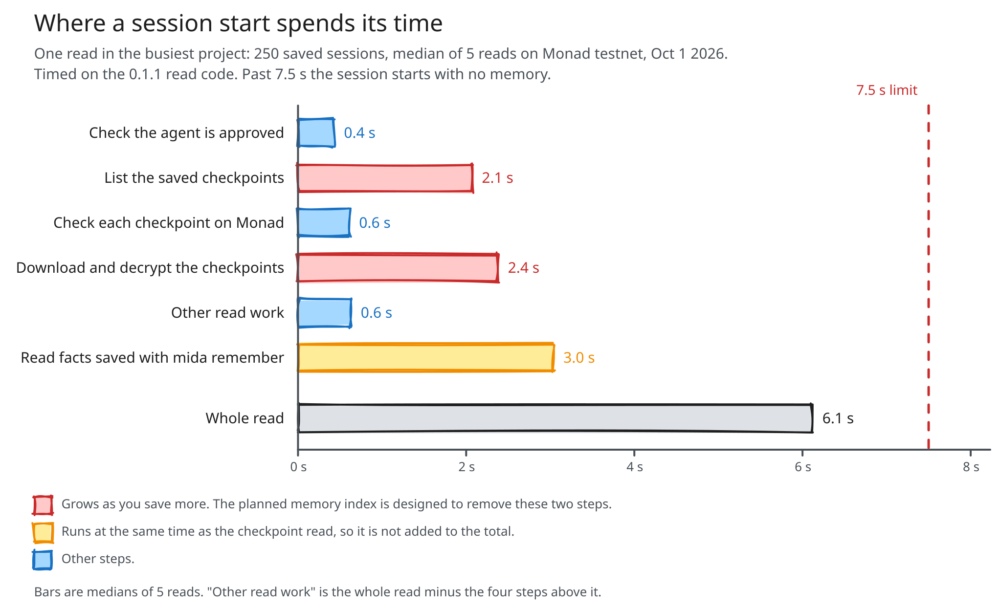
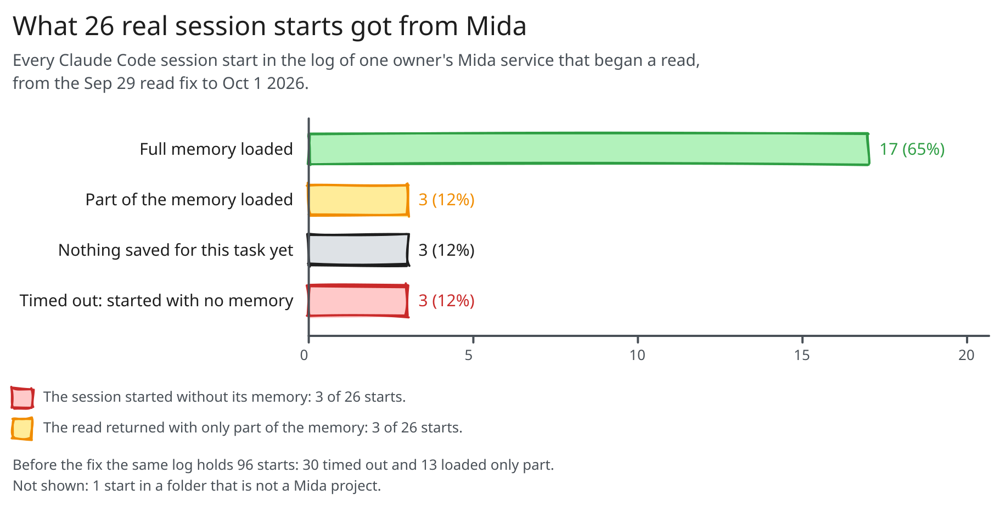

<h1 align="center">
  <picture>
    <source media="(prefers-color-scheme: dark)" srcset="brand/mida-lockup-animated-dark.svg">
    
  </picture>
</h1>

<p align="center">
  
  
  
  
  
</p>

<p align="center">
  <b>Switch AI coding agents without starting over.</b> Mida Context is a user-owned context layer
  for AI agents: encrypted under your keys, read only by agents you approve and can revoke on Monad.
  It keeps what you tell it about yourself and what your agents learn about your work. The first thing
  it proves is the hardest: one coding agent finishes the job another one started, with your
  decisions, preferences, last-minute changes and style rules carried over.
</p>

<p align="center">
  <a href="https://app.midacontext.xyz"><b>Owner page</b></a> &nbsp;·&nbsp;
  <a href="docs/quickstart.md">Full walkthrough</a> &nbsp;·&nbsp;
  <a href="docs/use-cases.md">Use cases</a> &nbsp;·&nbsp;
  <a href="docs/evidence">Evidence</a> &nbsp;·&nbsp;
  <a href="#quickstart">Run it yourself</a>
</p>

---

## The problem

Right now you are the API between your AI tools: when you switch, you carry the context across by
hand. One agent runs out of usage, crashes, or you want a different one for the next part of the
job. The new agent starts blind. What you asked for, what the first agent
decided and why, what it tried and dropped, what is left: all of it stays inside the first tool.

We measured what "blind" costs. Claude Code started a five-step job and was cut off after the
first step. A fresh Codex session in the same folder got one word, "Continue." Handed nothing, it
finished **0 of 5** runs. In all five its tests passed and it stopped there, because it never
learned that the other four steps existed. Handed a Mida handoff, it finished **5 of 5**.
A second scorer checked all fifteen runs without knowing which was which, and agreed.

Pasting the first session's whole transcript also finished 5 of 5. Those sessions were under two
minutes long, so the transcript fit. Mida does that step for you, in every tool. A long session
no longer fits in a paste, and this benchmark has not tested one yet
([method and every run](docs/evidence/continuation-benchmark-2026-10-02.md)).

A paste is also frozen at the moment you make it. In a second benchmark the owner changed one
decision in another agent's session after Codex had started work, and nothing on disk recorded
it. With Mida, Codex applied the change in **5 of 5** runs when its session resumed. Without
Mida the change never reached it, in 10 of 10 runs
([method and every run](docs/evidence/late-change-benchmark-2026-10-02.md)).

Today you paste transcripts or keep a notes file. That file belongs to no one, any program on your
machine can read it, and you cannot take it back from an agent you stop trusting. The tools also
change every few weeks. Your context should not be the reason you stay with one of them.

> [!IMPORTANT]
> **Pre-release. Monad testnet only. Not audited.** The full loop ran live on Monad testnet on
> Sep 27, 2026: Claude Code to Codex and back, Devin, Claude Desktop, and a revoke that cut an agent
> off mid-project ([what ran](docs/evidence/live-tests-2026-09-27-to-29.md)). See
> [What works and what doesn't](#what-works-and-what-doesnt) before you rely on it.

## What Mida does

Mida is a small service on your machine plus a set of permission rules on a public blockchain
(Monad testnet).

- **It captures.** Hooks in your agent tell the service what the session is doing.
- **It summarises.** A model you choose turns the session into a **checkpoint**: your original
  request word for word, the goal, progress, decisions with reasons, rejected approaches,
  constraints, and the next step. A message you typed mid-session counts as yours, and a later
  instruction from you overrides the first one.
- **It encrypts on your machine.** The store only ever holds ciphertext.
- **It records permissions and authorship on Monad.** The chain says which agent may read which
  kind of context and which agent wrote each record. Content never goes on chain.
- **It hands off.** When an approved agent starts a session, Mida prints the latest checkpoint into
  it. You type "Continue." Mid-session, the agent can ask Mida again through its MCP tools.
- **You decide.** Only you approve or revoke an agent, from your own terminal. An agent cannot
  approve itself.

<picture>
  <source media="(prefers-color-scheme: dark)" srcset="docs/architecture/mida-architecture-dark.svg">
  
</picture>

## Who builds on Mida

Mida is a primitive for developers. Three kinds of software need what it provides:

- **Agents that hand work to other agents.** A planner hands to a coder, one vendor's agent hands to
  another's, a crashed session hands to a fresh one. They need the work to survive the switch.
- **Apps that act for a person.** Assistants, coding agents and MCP clients need the context the
  person approved, and only that.
- **Multi-agent systems that must show who did what.** Agent marketplaces, audit trails and agent
  registries need a record of which agent wrote or decided each thing that anyone can check.

Building this yourself means per-agent keys and encryption, a permission list the user controls and
can revoke, provenance someone else can verify, a handoff format, and an export so users can leave.
Teams keep rebuilding a slice of it by hand. The SDK gives you all of it in a few calls:

```ts
import { Mida } from "@mida-context/sdk"

const mida = new Mida({ agent: "my-agent" })
const { items } = await mida.context({ namespace: "projects.current", limit: 8192 })
await mida.remember({ namespace: "projects.current", content: { note: "user prefers pnpm" } })
```

The user registers your agent once with `mida add-agent my-agent`, and approves it with `mida approve my-agent`. Everything the SDK reads passes the
grants the user signed; your app never holds the user's owner keys. Full reference:
[`docs/sdk.md`](docs/sdk.md).

---

## Contents

- [Quickstart](#quickstart)
- [Supported agents](#supported-agents)
- [How it works](#how-it-works)
- [Commands](#commands)
- [Who writes the summaries](#who-writes-the-summaries)
- [Remove Mida](#remove-mida)
- [Security model and limits](#security-model-and-limits)
- [What it costs to run](#what-it-costs-to-run)
- [What works and what doesn't](#what-works-and-what-doesnt)
- [Benchmarks](#benchmarks)
- [How it scales](#how-it-scales)
- [Where Mida is going](#where-mida-is-going)
- [Repository layout](#repository-layout)

---

## Quickstart

**You need:** macOS, Linux or Windows, Node.js 22 or later, and Claude Code and/or Codex. Nearly
all our live runs are on macOS. Linux has one [first run](docs/evidence/linux-first-run-2026-10-02.md)
on Ubuntu and Windows one [end-to-end run](docs/evidence/windows-first-run-2026-10-04.md) on
GitHub's Windows machine, both without an agent on the machine. By default Mida uses a hosted encrypted store and a gas sponsor, so you need no
testnet tokens. A setup made before the sponsor existed joins it with `mida sponsor on`.

Mida needs a model to write its summaries. With Claude Code or Codex installed and logged in, it
uses their small models. With neither (Claude Desktop or Cursor only, for example), give it an API
key with `mida summarizer use key`; until you do, nothing is saved, and `mida doctor` says so.

```bash
npm install -g mida-context     # npm prints peer-dependency warnings about `ox`; they are harmless
mida init                       # your owner key, an identity for each agent, and one question (below)
mida install claude-code        # hooks, plus Mida's MCP tools so a session can ask Mida mid-task
mida install codex              # the same; then open Codex once, type /hooks, and trust the Mida entries
mida doctor                     # one line per check; a PROBLEM line says what is wrong
```

**On Windows,** run the same commands in PowerShell or Windows Terminal. Claude Code needs version
2.1.139 or later there: Mida writes its hooks in the form that runs without a shell, and older
versions skip it. Codex runs hooks through PowerShell, and Mida writes them that way; trust them
once with `/hooks` as on a Mac. In the rare Codex session that runs hooks through `cmd.exe`
instead, Mida's hooks do not run.

**If an agent sets Mida up for you,** it can run the five commands above. `mida init` cannot ask its
one question from an agent's shell, so the default applies: ask the agent to run `mida summarizer`
and show you the answer before you go on. The next block it cannot do for you.

`mida init` asks one question: who writes your summaries. Press Enter to use your agents' own
small models, or choose your own API key. It asks only in a terminal, and only when nothing has
chosen yet; `mida summarizer` shows the current choice at any time.
[Who writes the summaries](#who-writes-the-summaries) says who reads your chat in each case. To own
your Mida with a passkey instead of a key file, see [Owner key or passkey](#owner-key-or-passkey).

`mida init` sets up three identities: `claude-code`, `codex`, and a general one called `assistant`
that never gets access to a project. At this point `mida doctor` prints two PROBLEM lines, because
neither agent has asked for access yet. The next block fixes that.

Then, inside your project folder, in a real terminal window, run these four yourself, one after
another (a request lasts 5 minutes):

```bash
mida request claude-code
mida request codex
mida approve --all              # shows what each agent asks for; type yes (a request lasts 5 minutes)
mida doctor --live claude-code  # starts a throwaway session and checks that Mida's hook fires
```

These commands talk to Monad testnet. If one says the request timed out, run it again.

Work in Claude Code as usual. When you stop, or it runs out, give Mida about a minute to save:
`mida doctor` prints `queue empty` when it is done. Then open Codex in the same folder. Mida hands
it a block that starts `MIDA HANDOFF` and holds the checkpoint. Type **Continue.** If your last
request told the first agent to stop at a certain point, say what comes next instead, for example
"Continue with step 2."

When you want to cut an agent off:

```bash
mida revoke codex               # codex's future reads are refused, on chain
```

The full walkthrough, with the expected output of every step, is
[`docs/quickstart.md`](docs/quickstart.md).

### Owner key or passkey

**The default, `mida init`, never uses a passkey.** Your owner key is a file on your computer
(`~/.mida/owner/`). You approve and revoke agents in the terminal by typing `yes`. The quickstart
above and the demo use this setup.

**Passkey mode, `mida init --passkey`.** Your owner key is a passkey on your device (for example
Touch ID or Face ID) and never sits on disk. You touch it only for owner decisions:

1. **Signing up:** once, when you create your owner on [app.midacontext.xyz](https://app.midacontext.xyz).
2. **Approving an agent:** you see the request in the terminal and type `yes`, then the passkey page
   asks for one touch per agent. With `mida approve --all` it is still one `yes` in the terminal, then
   one touch for each agent.
3. **Revoking an agent:** on the same page.
4. **Viewing your records** at [app.midacontext.xyz/me](https://app.midacontext.xyz/me), through
   "Sign in with passkey".

Agents never use your passkey. They save and read with their own keys, so saves, handoffs and
`Continue.` work the same in both modes. In passkey mode Monad checks your device's signature on each
approval itself, through its P256 precompile, so the approval is signed by you, not by Mida's server.

Tested live once so far: a passkey owner on a Mac, in Safari
([evidence](docs/evidence/m3-passkey-live-2026-09-22.json)). Not available in passkey mode yet:
`mida export`, which supports key-file setups only in this version.

**Updating.** Run `npm install -g mida-context@latest`, then `mida doctor`. Doctor replaces the
background service the old version left running; if that service is finishing a save, doctor waits
up to a minute for it.

**Something wrong?** Run `mida doctor` and `mida summarizer`, then open an
[issue](https://github.com/damli40/mida-context/issues) with both outputs and your version
(`npm ls -g mida-context`). They print no API keys and none of your session text.

<details>
<summary>Install from source instead</summary>

You need pnpm (`npm install -g pnpm`).

```bash
git clone --recurse-submodules https://github.com/damli40/mida-context && cd mida-context
pnpm install && pnpm build:publish
cd publish/cli && npm pack && npm install -g mida-context-0.1.4.tgz
```

Windows PowerShell does not accept `&&`, so there it is one command per line:

```powershell
git clone --recurse-submodules https://github.com/damli40/mida-context
cd mida-context
pnpm install
pnpm build:publish
cd publish/cli
npm pack
npm install -g mida-context-0.1.4.tgz
```

</details>

## Supported agents

| Agent | How Mida connects | Status |
|---|---|---|
| Claude Code, in the terminal or the desktop app | Hooks, plus the MCP server for mid-session reads | Hooks live, Sep 27; desktop app live, Oct 4 ([evidence](docs/evidence/claude-code-desktop-app-2026-10-04.md)); MCP server in tests |
| Codex CLI and the Codex app | Hooks (trust them once in `/hooks`), plus the MCP server | Hooks live, Sep 27; MCP server in tests |
| Devin | Hooks | Live, Sep 27 |
| Claude Desktop | MCP server `mida-mcp`: `mida_handoff`, `mida_whats_new`, `mida_read`, `mida_status`, `mida_save` | Live, Sep 27 |
| Cursor | The same MCP server | In tests |
| Your own app | The SDK | In tests, local chain |

Each client gets its own identity, so you approve and revoke them one at a time. `mida install
<client>` writes the configuration for you, the MCP server included; for Claude Code and Codex, `--no-mcp` leaves it out. ChatGPT chats are not supported: they cannot run local
hooks or a local MCP server.

Mida does not save `claude -p` runs, the one-off Claude Code calls a script makes in your project
folder. Set `MIDA_CAPTURE_HEADLESS=1` in the environment that starts them if you want them saved.

---

## How it works

### On Monad testnet

| Contract | What it records | Address |
|---|---|---|
| CapabilityRegistry | Which agent may read or write which area, and every revocation | [0xADFb…039b](https://testnet.monadvision.com/address/0xADFbeBC7A653E4287ae30c87D32D7aD647D7039b) |
| ContextRegistry | Who wrote each saved checkpoint: fingerprints, never content | [0x75fB…FB78](https://testnet.monadvision.com/address/0x75fB6dB9af93A8d823e51c488CaA913ca711FB78) |
| BatchAnchor | One Merkle root per batch of agent-signed saves, each save still signed by its agent | [0xe5dc…a9E1](https://testnet.monadvision.com/address/0xe5dcf76B1109906A16587cD2FE02c1e6f4a7a9E1) |

Source verified on [Sourcify](https://sourcify.dev/).

<details>
<summary><b>The path of one checkpoint</b></summary>

1. **Capture.** When the agent uses a tool, stops, compacts its context, or ends a session, its hook
   writes one small job into a queue and pokes the local service (`midad`). The hook does nothing
   slow, so your agent never waits on Mida.
2. **Summarise.** The service reads the session file, removes secrets (API keys, private keys,
   passwords, bearer tokens), and sends the text to your compile model, which returns the
   checkpoint as JSON. Messages you typed stay in view in long sessions too; if there are many, Mida keeps the newest and says how many it left out.
3. **Seal.** Mida encrypts the checkpoint on your machine with a key only approved agents can unwrap.
4. **Store.** The ciphertext goes to your local store or the hosted `store.midacontext.xyz`, which
   never has the keys.
5. **Anchor.** A Monad transaction records the author and a fingerprint of the content. With
   batching on, Mida's batcher anchors saves for you and pays the gas.
6. **Hand off.** When an approved agent starts, Mida reads the checkpoints as that agent, checks each
   permission against the chain, merges them, and prints the result into the new session.

</details>

<details>
<summary><b>What lives where</b></summary>

| Thing | Where | Who can read it |
|---|---|---|
| Checkpoint content | Encrypted store (local or hosted) | Agents you approved, with their own keys |
| Permissions, revocations, authorship | Monad testnet contracts | Anyone: they show that an agent may read an area, never the content |
| Your owner key | `~/.mida/owner/`, or your passkey (never on disk) | You |
| Agent keys | `~/.mida/agents/` | That agent's process on your machine |

Contracts: `CapabilityRegistry` (agents, grants, read-key generations, revocation),
`ContextRegistry` (authorship and history, fingerprints only) and `BatchAnchor` (many saves under one
Merkle root). Testnet addresses: [`contracts/deployments/10143.json`](contracts/deployments/10143.json).

Hosted services, all optional: `store.midacontext.xyz` holds ciphertext it cannot read,
`sponsor.midacontext.xyz` pays gas for Mida's own contract calls and can sign nothing else, and
`app.midacontext.xyz` is the passkey page for sign-up, approve and revoke.

</details>

<details>
<summary><b>Projects, folders and tasks</b></summary>

A project is a `.mida/project.json` marker; the nearest one up the tree wins. You approve an agent
per project. `mida link <folder>` lets a second folder join a project; `mida unlink` takes it out.

A project can hold several efforts at once. `mida task <name>` sets the folder's current task, and
each session keeps the task it started with. A handoff carries only its own task's checkpoints and a
one-line mention of the others. Facts and preferences you save with `mida remember` belong to every
task.

</details>

---

## Commands

| Command | What it does |
|---|---|
| `mida init` / `mida init --passkey` | Create your owner key and agent identities, start the service |
| `mida install <client> [--no-mcp]` / `uninstall <client>` | Add or remove Mida for `claude-code`, `codex`, `devin`, `claude-desktop`, `cursor`. `--no-mcp` applies to `claude-code` and `codex` |
| `mida doctor` / `doctor --live claude-code\|codex` | Check everything; a PROBLEM line says what is wrong and, where there is one, the command that fixes it. `--live` starts a throwaway session and checks the hook fires |
| `mida summarizer` / `summarizer use agents\|key` / `summarizer test` | See who writes your summaries, switch it, or write one test summary |
| `mida request <agent>` | The agent asks for access |
| `mida approve <agent>` / `approve --all` | You approve it for this folder (terminal only; type `yes`) |
| `mida revoke <agent>` / `revoke --all` | End its access and rotate the read keys (terminal only) |
| `mida remember "<fact>"` | Save a fact about you that approved agents can read |
| `mida read --as <agent>` | See which areas that agent can read, and how many records in each |
| `mida link <folder>` / `unlink` / `project new` | Manage which folders share a project |
| `mida task [<name> \| --clear \| show <name>]` | Set, clear or read a named task |
| `mida export <folder>` | Write everything the chain attributes to you, decrypted, into a new folder |
| `mida add-agent <name>` | Register an identity for your own SDK app |
| `mida batching on\|off` | Anchor saves in shared batches (sponsored) or one transaction each |
| `mida sponsor on\|off` | Let the gas sponsor pay for your saves and grants, or go back to paying your own testnet gas |

"Terminal only" means the command refuses to run from inside an agent.

---

## Who writes the summaries

When a session ends, Mida turns the chat into a short record for your next agent. A model has to
write that record, and it is the one part of Mida that reads your session text. So you choose it:
`mida init` asks, and `mida summarizer` shows the answer and changes it.

| Choice | Who reads your chat | What it uses |
|---|---|---|
| **Your agents' small models** (the default) | Anthropic or OpenAI, under your own login. Claude Code's `haiku` goes first; Codex's `luna` takes over if Claude can't | Your plan: about one small-model message a minute while your agent works. When your plan hits its limit, that model stops |
| **Your own API key** | The provider you choose: DeepSeek, Moonshot, or any OpenAI-compatible endpoint, a local model included | Your key. Most providers charge under one cent a summary |

```bash
mida summarizer                 # who writes them now; `mida summarizer test` is the real check that one works
mida summarizer use agents      # your agents' small models
mida summarizer use key         # asks for a provider and a key; stores it in ~/.mida, readable only by you
mida summarizer test            # writes one test summary, says who wrote it, retries waiting saves
```

What to know before you pick:

- **Install both tools if you can.** A plan's limit covers every model on that plan, the small one
  included. With only Claude Code installed, summaries stop when Claude does. With Codex installed
  too, Codex's small model writes them, and the hand-off still works.
- **The backup crosses companies.** When Codex writes the summary of a Claude Code session, OpenAI
  reads that session's text. Choose your own key if you want one named reader.
- **Your own key has no backup.** A failed call is retried, never sent to another provider.
- **A save that cannot be written yet waits.** A save waiting on a usage limit is retried every
  hour. A save whose summary keeps failing is retried often at first, then a few times a day,
  by then asking each model once per try, so a stuck save cannot drain your plan. Mida stops
  once that session has been quiet for seven days. The next agent's handoff says saves are
  waiting, and `mida doctor` names the reason. Fixed the cause? Run `mida summarizer test`: when
  it passes, Mida retries the waiting saves. Mida gives up early in one case: a save the model
  keeps answering with something it cannot use.
- Secrets are scrubbed before any model sees the text, and again from its answer.

The agent tools run in an empty folder with their hooks and your personal settings switched off.
Codex runs in its read-only sandbox, so it can change nothing. A current Claude Code runs with no
tools at all. An older Claude Code that lacks that switch runs with its tools under their default
permission rules, so update Claude Code if you rely on this.
Measured on Oct 1, 2026 with one sample
([evidence](docs/evidence/summariser-probe-2026-10-01.md)): a 5,000-character session took Claude's
small model 21 seconds and Codex's 35 seconds; both returned a valid record, and each missed one
detail the other caught.

<details>
<summary>Environment variables (what Mida used before 0.1.2, still honoured when you have saved no choice)</summary>

With no saved choice, Mida tries DeepSeek (if `DEEPSEEK_API_KEY` is set), then Kimi (if
`KIMI_API_KEY` is set), then your agents' small models. Any server that speaks the OpenAI-compatible
chat-completions API can replace them, a local model included:

```bash
export MIDA_COMPILE_MODEL=custom
export MIDA_COMPILE_BASE_URL=http://127.0.0.1:11434/v1    # e.g. a local Ollama server
export MIDA_COMPILE_MODEL_ID=<your model name>
mida summarizer                                         # shows what the running service uses
```

- The endpoint must be `https://`, or `http://` on loopback only.
- A failed custom compile has no fallback, so Mida never sends your text to a vendor you did not
  pick. Set `MIDA_COMPILE_FALLBACK=1` to allow it.
- Mida strips `ANTHROPIC_*` variables from everything it starts.
- The background service reads these from whatever started it, which may not be your shell. A
  saved choice (`mida summarizer use ...`) does not have that problem.

</details>

Your model returns one JSON object with ten fields; the schema and limits are in
[`packages/checkpoint/src/schema.ts`](packages/checkpoint/src/schema.ts). Mida trims fields over
their limits, retries a bad answer once, and scrubs secrets from the output again before saving.

---

## Security model and limits

**What Mida protects**

- Content is encrypted on your machine. The store and the chain never see plaintext.
- Only agents you approved can decrypt, and every read is checked against the chain.
- Only you approve and revoke, from your own terminal.
- Every record on Monad carries its author, so a handoff says which agent wrote each part.
- Secrets are scrubbed from session text before your compile model sees it, and again from its output.

**Its limits**

- **Revoking stops future reads. It cannot take back what an agent already read.**
- **Project scoping is enforced on your machine, not on chain.** The chain grants a kind of context;
  the local service checks which folder, against a list you signed. A program already running as
  you with an agent's key file could bypass that check.
- **Tasks organise work; they are not a permission boundary.** An agent approved for a project can
  read every task in it.
- **Software-mode keys are files on your disk.** Passkey mode keeps the owner key off disk; agent
  keys are always files.
- **The model that writes your summaries sees your scrubbed session text.** A local model keeps it
  on your machine. [Who writes the summaries](#who-writes-the-summaries) names the reader for each
  choice.
- **Testnet only, not audited.** Do not store anything you cannot afford to lose. We have asked
  OpenZeppelin and CertiK for audit quotes; the contracts go to mainnet only after an independent review. We have asked two
  audit firms for quotes; the contracts go to mainnet only after an independent review.

**What a handoff keeps, and what it leaves out**

- A handoff never leaves out a constraint, a decision or a rejected approach to save space. When
  it runs long, Mida trims progress notes, the list of saves and file lists first, then the
  reasons behind decisions, and says at the top what it left out.
- A list holds at most 50 entries per save. Past that, Mida keeps the newest 50 (for the remaining
  plan, the first 50). When constraints, decisions or rejected approaches were left out, the
  handoff says so; progress notes and file lists are cut without a note.
- A save that has not reached Monad yet is shown to the next agent marked `UNSENT`, with a warning
  that the chain has not checked it.
- An instruction you meant for one session can reach the next agent as a standing rule. "Do step 1,
  then stop" made the next agent answer "Stopped as requested"; "don't change files in this
  session" made it ask for permission. When you continue, say what comes next.

**The gas sponsor's limits**

- The hosted sponsor pays for a set number of saves per agent each day, and has one daily budget
  shared by everyone. `mida doctor` prints the live numbers. Both reset at 00:00 UTC.
- When the limit is reached, saves wait on your machine. Mida retries them every hour and right
  after the reset. The next
  agent's handoff says they are waiting. Mida keeps a waiting save until its session has been
  quiet for seven days.

**Approvals**

- Approving an agent again after its grant expires (grants last 30 days) no longer scans the
  chain's history; it asks the contract. One case is not seen: a single permission revoked on its
  own and later tidied away by a new grant, on a machine that never saw the revoke. `mida revoke`
  always revokes the whole agent, which every machine sees.

---

## What it costs to run

Each save is one call to the model that writes your summaries and one Monad transaction, or a share
of a batch with batching on. An agent at work saves about once a minute at most.

- **Gas.** On testnet the sponsor pays, so you pay nothing. A sponsored save cost about 0.067
  testnet MON on average (191 saves, Sep 29 to Oct 1). Mainnet costs are not measured.
- **Summaries on your agents' plans.** Each summary is one small-model message. Mida's Claude
  command adds about 3,600 tokens of overhead per call; Codex's adds about 25,000, which is why
  Claude goes first (measured Oct 1, one call each).
- **Summaries on your own key.** A typical summary reads about 3,800 tokens and writes about
  5,000 (median of 235 saves). At list prices on Oct 1, 2026 that is under one cent on most
  providers.

---

## Remove Mida

```bash
mida revoke --all                       # end every agent's access, on chain; run in a terminal, type yes
mida uninstall claude-code              # remove the hooks and the MCP entry; repeat for each tool
mida uninstall codex
pgrep -fl midad                         # Mida's background service; `kill` the number it prints
npm uninstall -g mida-context
```

Stop the background service before you uninstall the package; left alone, it keeps running until
you restart your machine. There is no `mida stop` command yet. On Windows, `pgrep` does not exist:
find the service's number with
`Get-CimInstance Win32_Process -Filter "Name='node.exe'" | Where-Object CommandLine -like '*midad*' | Select-Object ProcessId`
and stop it with `taskkill /PID <number> /F`. Mida's folder there is `%USERPROFILE%\.mida`.

Three things stay until you delete them: `~/.mida` on your machine (your keys, the queue and the
logs), the `.mida` folder in each project, and the encrypted records in the store. Records of who
wrote what, and which agent you approved or revoked, are on Monad testnet and cannot be removed;
they hold fingerprints, never content. Delete `~/.mida` only when you are sure: in the default
setup it holds the only copies of your keys, and without them nobody can decrypt what you saved,
you included. `mida export <folder>` writes a readable copy first.

---

## What works and what doesn't

| | Status |
|---|---|
| Set up, approve, save, hand off, revoke, live on Monad testnet | ✅ Sep 22 and Sep 27 ([evidence](docs/evidence/live-tests-2026-09-27-to-29.md)) |
| Handoff both ways between Claude Code and Codex | ✅ Live, Sep 27 |
| Devin, Claude Desktop, the Codex app | ✅ Live, Sep 27 |
| The Claude Code desktop app, with the same `mida install claude-code`: handoff at session start, update note on each prompt, saves | ✅ One session on macOS, Oct 4 ([evidence](docs/evidence/claude-code-desktop-app-2026-10-04.md)) |
| Passkey owner: sign-up and approve in the browser | ✅ Live, Sep 22 ([evidence](docs/evidence/m3-passkey-live-2026-09-22.json)) |
| Hosted store and gas sponsor | ✅ Live |
| Linux: install, set up, approve, save, hand off, revoke | ✅ Two runs on Ubuntu with no agent on the machine: 0.1.2 on Oct 2 ([evidence](docs/evidence/linux-first-run-2026-10-02.md)), and 0.1.3 installed from npm on Oct 4 ([evidence](docs/evidence/linux-npm-0.1.3-2026-10-04.md)) |
| Windows: install, set up, approve, the hook entries Claude Code and Codex run (Codex's through PowerShell), Claude Desktop's tool server, save, hand off, revoke | ✅ One run on GitHub's Windows machine, Oct 4, with no agent on the machine ([evidence](docs/evidence/windows-first-run-2026-10-04.md)). No real agent has run on Windows yet |
| Batching: saves anchored by Mida's batcher, gas sponsored | ✅ Live for invited owners, Sep 29 ([evidence](docs/evidence/live-tests-2026-09-27-to-29.md)) |
| A change of plan you make mid-session reaches the next agent, credited to you | ✅ 6 of 6 on a real model, was 0 of 6 ([evidence](docs/evidence/live-tests-2026-09-27-to-29.md)) |
| A new session in a busy project reads every save in batched chain calls: 155 saves in 5.1 s, where it used to time out | ✅ Live, Sep 29 ([evidence](docs/evidence/live-tests-2026-09-27-to-29.md)) |
| Session start in a large account | ⚠️ Measured Oct 1: 6.1 s at 250 saved sessions, against a 7.5 s cut-off. It slows as you save more ([How it scales](#how-it-scales)) |
| Summaries written by your agents' own small models: Claude Code's first, Codex's when Claude can't | ✅ Run for real, Oct 1 and 2 ([evidence](docs/evidence/summariser-probe-2026-10-01.md)) |
| A save that can't go out yet waits and is retried, and the next agent is told: the sponsor's daily limit, a model at its usage limit | ✅ In tests. We found the gap in a real outage on Oct 1 ([evidence](docs/evidence/sponsor-daily-limit-2026-10-01.md)) |
| Mid-session reads from Claude Code and Codex through Mida's MCP tools | ✅ In tests (Claude Desktop live, Sep 27) |
| `mida sponsor on\|off` for a setup made before the sponsor existed | ✅ In tests |
| SDK, named tasks, folder linking, `mida export` | ✅ In tests on a local chain; not yet run live |
| Owner view in the browser (`app.midacontext.xyz/me`): your records, each checked on Monad | ✅ Live, Sep 29; it does not list agents yet |
| npm packages: [`mida-context`](https://www.npmjs.com/package/mida-context), [`@mida-context/sdk`](https://www.npmjs.com/package/@mida-context/sdk) | ✅ Published, Sep 29 |
| A paid job for another team: Kanmani's escrow on Monad mainnet paid a Mida agent 0.50 USDC to recheck 10 payment claims ([the claims](https://kanmani.xyz/claims)). The brief and the findings were Mida records written by that agent, and the delivery pointed at the findings record. Kanmani could check the record on chain but could not read it, because sharing with another team's app isn't shipped yet | ✅ Oct 5 ([evidence](docs/evidence/kanmani-job-2026-10-05.md)) |
| An agent that another team's registry controls: before it pays, a Mida agent checks the `DelegationRegistry` of [TrustLayer](https://github.com/Valorian0108/Trustlayer), another Monad Metropolis team, on Monad testnet. It reads the owner's brief through Mida and writes its receipt as a Mida record. In the live run it paid 0.01 MON once, refused the same brief again, and refused after each revoke: TrustLayer's, then Mida's. TrustLayer merged it into their repository on Oct 6 ([PR #2](https://github.com/Valorian0108/Trustlayer/pull/2)) | ✅ Oct 6 ([evidence](docs/evidence/trustlayer-integration-2026-10-06.md)) |
| Security audit | ❌ None |

3,998 automated tests pass on this release: `pnpm test`.

---

## Benchmarks

Each benchmark has a file that gives the method, every run and the limits. All runs used one owner and one
machine, unless the Sample column gives a different setup. The [evidence index](docs/evidence/README.md) lists
every file.

| Benchmark | What it measures | Result | Sample |
|---|---|---|---|
| [Continuation](docs/evidence/continuation-benchmark-2026-10-02.md), Oct 2 | Agent A stops after step 1 of 5. A new agent gets one word, "Continue." The test measures if the new agent completes the job. | With a Mida handoff, 5 of 5 runs completed the job. With no handoff, 0 of 5 completed. With the full transcript pasted, 5 of 5 completed, because the sessions were short. | 15 runs, 5 for each condition. Two scorers. |
| [Late change](docs/evidence/late-change-benchmark-2026-10-02.md), Oct 2 | The owner changes one decision in a different agent's session. No file records the change. The test measures if the agent that does the job applies the change. | With Mida, 5 of 5 runs applied the change. With no Mida, 0 of 5. With a transcript pasted at the start, 0 of 5. | 15 runs, 5 for each condition. |
| [Both benchmarks again](docs/evidence/benchmarks-rerun-2026-10-03.md), Oct 3 | The test runs the two benchmarks again with Mida, after the Oct 3 changes to the summary input. | The results did not change. 5 of 5 runs completed the job, and 5 of 5 applied the late change. | 10 runs, Mida only. |
| [First "Continue." test](docs/evidence/handoff-design-and-benchmark-2026-09-20.md), Sep 20 | A new Codex gets a job that is half complete and one word, "Continue." The test measures if it completes the job. | With no handoff, 0 of 6 runs completed. In all 6, the tests passed and the agent said that the job was complete. With a Mida handoff, 3 of 3 completed. | 9 runs. |
| [Change of plan in a session](docs/evidence/live-tests-2026-09-27-to-29.md), Sep 27 to 29 | The owner changes the plan during a session. The test measures if the next agent gets the change, with the owner as its source. | Before the fix, 0 of 6 runs. After the fix, 6 of 6 runs, on a real model. | 12 runs. |
| [A message typed while Claude Code works](docs/evidence/prov17-queued-message-2026-10-03.md), Oct 3 | The owner types a change while Claude Code works. The test measures if the summary gives the change as the words of the owner. | Before the fix, 0 of 3 runs for each model. After the fix, 3 of 3 runs for each model. | 12 runs: 3 for each build and model (DeepSeek and Claude Haiku). |
| [Tool output labels](docs/evidence/prov19-tool-output-label-2026-10-04.md), Oct 4 | The test measures if Mida shows tool output to the summary model as the words of the owner. | Before the fix, Mida labelled tool output as the user. The fix changes the label. The summaries did not improve in this test. | 12 runs: 3 for each build and model. |
| [One session-start read](docs/evidence/session-start-read-2026-10-01/01-session-start-read-busy-project.md), Oct 1 | The test measures the time that Mida needs to load the memory of a project when a session starts. The limit is 7.5 seconds. | With 250 saved sessions, the read took 6.1 seconds (median of 5). Two steps read every checkpoint, so the time increases with each save. | 5 reads. |
| [Real session starts](docs/evidence/session-start-read-2026-10-01/02-session-start-outcomes.md), Sep 29 to Oct 1 | The test counts the real session starts that loaded their full memory. | 17 of 26 starts loaded all the memory. 3 loaded part of it. 3 stopped at the time limit. 3 had no memory saved for their task. | 26 session starts. |
| [Handoff read time](docs/evidence/handoff-read-time-2026-10-02.md), Sep 21 to Oct 2 | The test measures the time that a new session waits for its handoff, as the number of saved checkpoints increases. | The read time increased from 3.4 seconds at 26 checkpoints to 6.6 seconds at 334. Mida refused 44 of 196 reads because they were too slow. After the 0.1.2 change, three reads at 298 saves took 6.3, 3.3 and 2.8 seconds. | 196 reads, then 3 reads on a test build. |
| [Summary models of the agents](docs/evidence/summariser-probe-2026-10-01.md), Oct 1 and 2 | The test measures if the small models of Claude Code and Codex can write the summaries of Mida. | Both models wrote a valid summary with all 10 fields. Claude Haiku took 21 seconds. The Codex model took 35 seconds. | 1 session, 2 models. |
| [Daily limit of the gas sponsor](docs/evidence/sponsor-daily-limit-2026-10-01.md), Sep 27 to Oct 2 | The test finds why saves stopped before they got to Monad on some days. | The hosted sponsor stopped after approximately 60 saves for one agent in one day. Mida tried each refused save 8 times and then dropped it. | 6 days. |

---

## How it scales

A session start reads every checkpoint you have saved, in every project, and keeps the ones for the
project you are in. The store holds only ciphertext, so it cannot sort checkpoints by project; your
machine opens each one to find out. The read takes longer as you save more, and Mida gives it
7.5 seconds. Past that, the session starts without its memory.

We measured how close that cut-off is.

**One read, timed step by step (Oct 1).** In a project with 250 saved sessions the read took
6.1 seconds, the median of five. Listing the checkpoints took 2.1 s. Downloading and decrypting them
took 2.4 s. Both steps touch every checkpoint, so both grow as you save more. The read also opened
the owner's checkpoints from other projects, and the run did not record how many
([method and raw data](docs/evidence/session-start-read-2026-10-01/01-session-start-read-busy-project.md)).

<picture>
  <source media="(prefers-color-scheme: dark)" srcset="docs/evidence/session-start-read-2026-10-01/charts/01-session-start-breakdown-dark.svg">
  
</picture>

**Real session starts (Sep 29 to Oct 1).** The log of one owner's Mida service holds 26 session
starts that began a read after the Sep 29 fix. 17 loaded everything. 3 loaded only part of the
memory, 3 timed out and started with none, and 3 had nothing saved for their task. So 6 of the 26,
about one in four, did not get their full memory
([counts and limits](docs/evidence/session-start-read-2026-10-01/02-session-start-outcomes.md)).

<details>
<summary>Chart: what those 26 session starts got</summary>

<picture>
  <source media="(prefers-color-scheme: dark)" srcset="docs/evidence/session-start-read-2026-10-01/charts/02-session-start-outcomes-dark.svg">
  
</picture>

</details>

**What 0.1.2 changes.** Every read used to fetch two keys that never change, about 2 seconds each
time. 0.1.2 keeps them in memory. On the same account, at 298 saves, the first read after the
service started took 6.3 s and the next two took 3.3 s and 2.8 s
([method and raw data](docs/evidence/handoff-read-time-2026-10-02.md)). That is three reads on a
test build. We have not measured it on a running service over days.

**Not measured yet:** how much each extra checkpoint adds (we timed one size), and a session start
on a new account with a handful of saves. All of these measurements come from one owner on one
machine.

**We designed the fix. It is not in this release, and it is parked until after the hackathon.** Each agent will keep a memory index: a signed,
encrypted table of contents of its saved sessions. In the common case a session start will read the
index, check a handful of entries on Monad, and open the one checkpoint it needs. Checkpoints stay
the source of truth, and the chain decides which copy is newest. We built the store side and the
write side on a development branch; three adversarial reviews kept finding problems in the write
side, so we chose not to rush it. The reading side is not built.

---

## Where Mida is going

AI agents are moving into the cloud and staying on. xAI's Grok Bot, Meta's Muse and OpenAI's dots each run on
their own cloud computer and learn from you over time. The longer you work inside one, the more it holds about
your projects, preferences and decisions. You can export a file; months of an agent learning how you work are
much harder to take with you. Mida keeps that context yours wherever the model runs: the ciphertext can sit on a
hosted store, because you hold the keys and you approve every reader. Today that works for agents that connect
through Mida's hooks and MCP tools. Reaching cloud agents like these is part of the plan.

None of the following has shipped yet:

- **Cloud agents.** A remote Mida endpoint over MCP, with sign-in, for agents and chat apps that cannot run a
  program on your machine.
- **Sign in with Mida.** An app asks for scoped access to your context the way it asks you to sign in. You
  approve it, and later revoke it, like any agent.
- **Move in, move out.** Bring your context in from the AI tools you already use, and take it with you when you
  leave.
- **Teams.** Several people steer one agent, each with their own identity, so you can revoke one teammate
  without stopping the rest.
- **A separate permission for training.** Reading your context will not let an agent train on it.

The full list, and what you can use Mida for today: [`docs/use-cases.md`](docs/use-cases.md).

---

## Repository layout

| Path | What's there |
|---|---|
| `apps/midad` | The local service, the `mida` command, hooks, the MCP server |
| `packages/mida-context-sdk` | The SDK (`@mida-context/sdk`) |
| `packages/compiler` | Session reading, secret scrubbing, the compile call |
| `packages/checkpoint` | The checkpoint schema, merging and rendering |
| `packages/crypto`, `packages/protocol`, `packages/chain` | Encryption, signatures, chain access |
| `contracts` | The Solidity contracts and deployments |
| `apps/store-worker`, `apps/sponsor-worker`, `apps/owner-page` | The hosted store, gas sponsor and passkey page |
| `docs/quickstart.md`, `docs/sdk.md` | The walkthrough and the SDK reference |

Development: `pnpm install`, then `pnpm test` and `pnpm typecheck`. Node 22 or later.

**License: [MIT](LICENSE).** Issues and pull requests are welcome.
